# Adversary Emulation & Detection Lab


### Objective
The primary objective of this lab is to build and configure a functional adversary emulation and detection environment using virtualization and industry-standard security tools. Splunk Enterprise, Sysmon, and Splunk Universal Forwarder are installed and configured to establish a working SIEM infrastructure for log collection and analysis. Five specific Atomic Red Team attacks T1053.005, T1218.005, T1003.001, T1059.001, and T1112 are executed on the Windows Server using PowerShell. Effective SPL queries are crafted within Splunk to detect each attack based on behavioral indicators rather than simple keyword searches. The most helpful Sysmon Event IDs for each detection scenario are identified and documented. This exercise demonstrates the application of the MITRE ATT&CK framework in a practical lab setting.


### Lab Environment
| Host | Role | Operating System | IP Address | Key Software |
| :--- | :--- | :--- | :--- | :--- |
| Kali Linux | Control & SIEM | Kali Linux | 192.168.189.129 | Splunk Enterprise (web 8000, mgmt 8089, receiving 9997) |
| Windows Server | Victim & Telemetry | Windows Server 2019 | 192.168.189.130 | Sysmon, Splunk Universal Forwarder, Invoke-AtomicRedTeam |


### Tools Used
VMware Workstation Pro
Splunk Enterprise (SIEM)
Splunk Universal Forwarder
Sysmon
Atomic Red Team (ART)
PowerShell
MITRE ATT&CK
Git


### Virtual Machine Specification

| VM | CPU (Core) | RAM (GB) | Network Type |
| :--- | :--- | :--- | :--- |
| Kali | 2 | 2 | NAT |
| Windows Server 2019 | 2 | 2 | NAT |

Note: This is minimum requirement. For better performance, increase the allocated RAM.


## Part 1 – The Infrastructure Setup

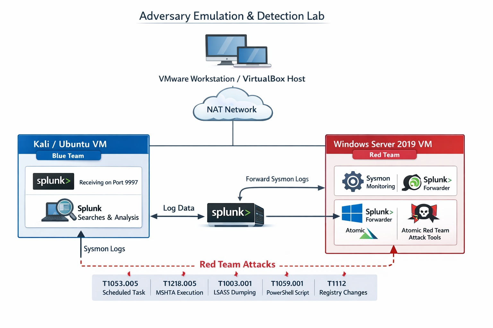
 
The lab runs two virtual machines on an isolated VMware NAT network (192.168.11.0/24). Kali Linux (192.168.189.129) hosts Splunk Enterprise as the SIEM/indexer. Windows Server 2019 (192.168.189.130) is the instrumented victim running Sysmon, a Splunk Universal Forwarder, and Atomic Red Team (the attack toolkit). Sysmon telemetry flows from the Windows Server to Splunk over port 9997, and analysis is performed through Splunk Web (port 8000).


### Kali Linux Settings
Kali VM – 2 vCPU, 2 GB RAM, NAT network adapter.
 
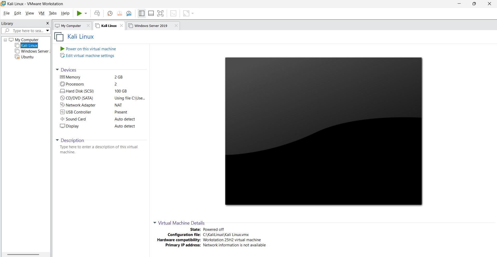

### Windows Server Settings
Windows Server 2019 VM – 2 vCPU, 2 GB RAM, NAT network adapter. This is the victim host (Sysmon, Splunk Universal Forwarder, Atomic Red Team)

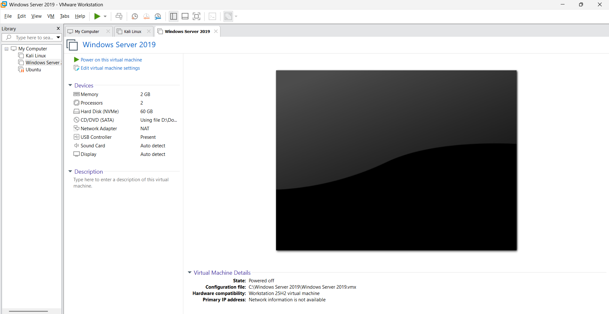
 


### Network Settings of Windows Server & Kali Linux

Windows Server is assigned ```192.168.189.130```.
Verify with:
```ipconfig
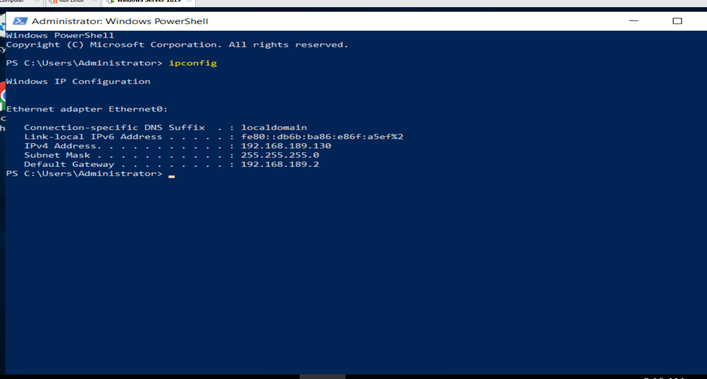
 
Kali Linux is assigned ```192.168.189.129 on the same NAT subnet, with the kali Splunk server reachable on ports 9997 (data)
```Ip a
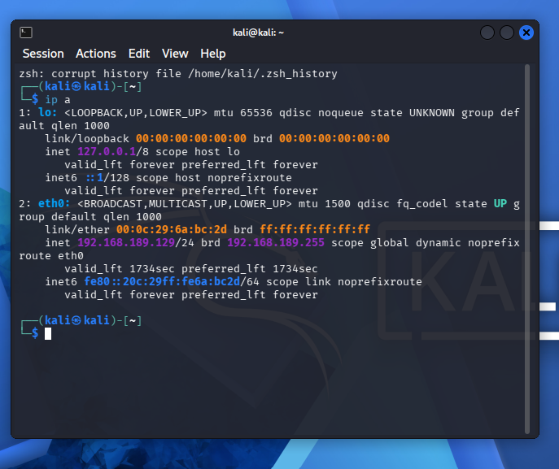


###Install Splunk Enterprise on Kali Linux
Kali Linux (192.168.189.129) acts as the SIEM. Create a free Splunk  account, download the Splunk Enterprise Linux package, then install and start it.
Step 1: Download Splunk Enterprise
```splunk
wget -O splunk.tgz "https://download.splunk.com/products/splunk/releases/9.4.3/linux/splunk-9.4.3-eab2f2db5f3b-linux-amd64.tgz"

Step 2: Extract Splunk
```splunk
sudo tar -xvzf splunk.tgz -C /opt

Step 3: Start Splunk for the First Time
```splunk
sudo /opt/splunk/bin/splunk start --accept-license

Step 4: Check Splunk Status
```splunk
sudo /opt/splunk/bin/splunk status
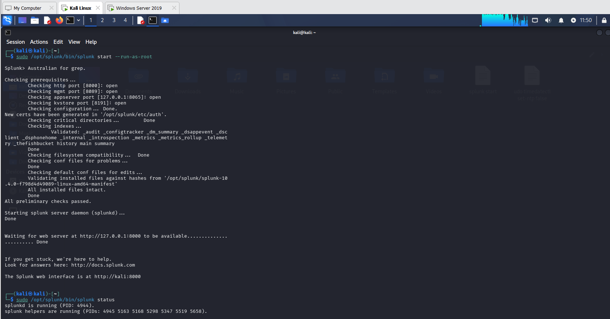
 

Step 5: Access Splunk Web Interface
```https:// 127.0.0.1:8000
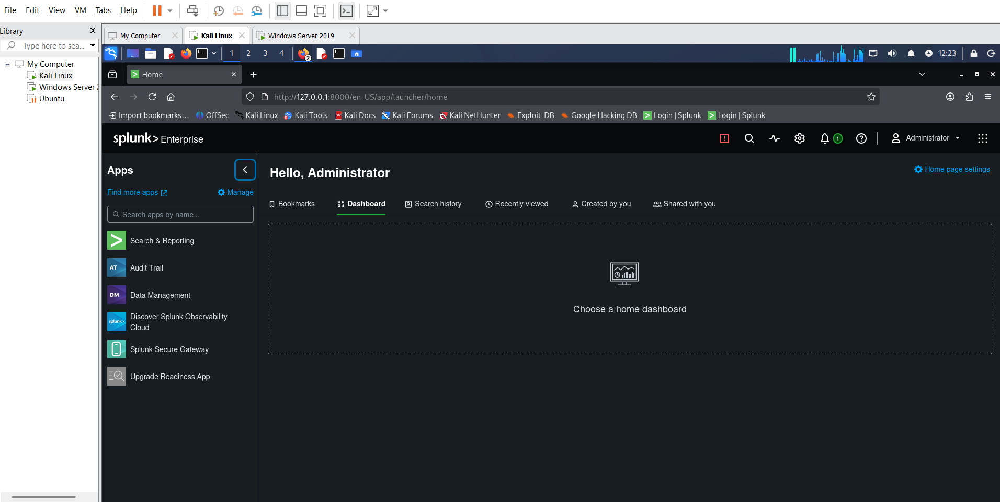 

Step 6: Enable receiving on port 9997
```splunk
sudo /opt/splunk/bin/splunk enable listen 9997 -auth admin:<password>
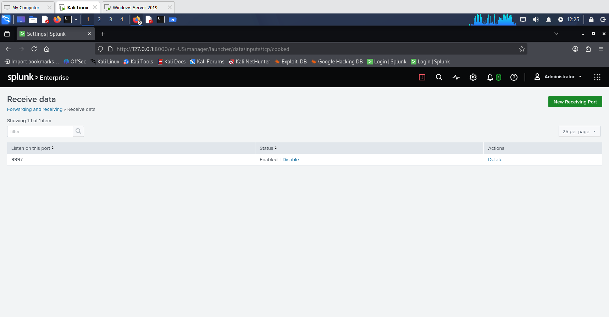
 

###Sysmon & Splunk Universal Forwarder Install in Windows Server
Install and configure Sysmon, download Sysmon from Sysinternals and a detection-focused configuration (the Wazuh sysmonconfig.xml referenced in the task sheet).
```powershell
cd C:\Lab\Sysmon
.\sysmon64.exe -accepteula -i sysmonconfig.xml

Verify the driver and service are running, and reload the config later with -c if you edit it:
```powershell
Get-Service Sysmon64
.\sysmon64.exe -c sysmonconfig.xml

Check Sysmon is properly installed or not. 
```powershell
Get-Service -Name “Sysmon*”
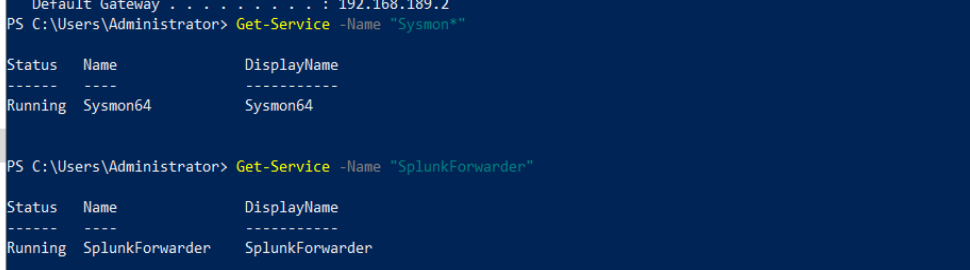 

###Install the Splunk Universal Forwarder
Download and run the Splunk Universal Forwarder MSI. During setup choose “An on-premises Splunk Enterprise instance”, and point the Receiving Indexer / Deployment Server at the Kali Splunk server: 192.168.189.129 (receiving 9997). Set an admin username and password when prompted.

Step1: Download Splunk Universal Forwarder
```powershell
cd C:\Downloads

Step 2: Install the Forwarder:
```powershell
msiexec.exe /i splunkforwarder-*.msi AGREETOLICENSE=Yes RECEIVING_INDEXER="192.168.189.29:9997" WINEVENTLOG_SEC_ENABLE=1 WINEVENTLOG_SYS_ENABLE=1 WINEVENTLOG_APP_ENABLE=1 LAUNCHSPLUNK=1 /quiet

Step 3: Verify Installation
```powershell
Get-Service SplunkForwarder

 


###Configure Inputs 
Create an inputs.conf that forwards the relevant Windows event channels into the win index. Place it at C:\Program Files\SplunkUniversalForwarder\etc\apps\TA-local-sysmon\local\inputs.conf:

```notepad
[WinEventLog://Microsoft-Windows-Sysmon/Operational]
disabled = false
renderXml = true
index = main

 

###Restart the forwarder and confirm the monitored inputs:
```powershell
.\splunk.exe restart
.\splunk.exe list monitor


##PART 2 : The Attack (Red Team)
Each technique is first listed with -ShowDetailsBrief, then executed with Invoke-AtomicTest. Use -GetPrereqs to download any required tools (e.g. procdump), and -Cleanup afterwards to revert changes. Run every command in an elevated PowerShell session.

###Invoke-AtomicRedTeam setup

1. Install the Core Execution Framework
```powershell
IEX (New-Object Net.WebClient).DownloadString('https://raw.githubusercontent.com/redcanaryco/invoke-atomicredteam/master/install-atomicredteam.ps1')
```powershell
Install-AtomicRedTeam -InstallPath "C:\AtomicRedTeam" 

2. Download the Attack Test Library (Atomics)
```powershell
-Install-AtomicRedTeam -AtomicsFolder "C:\AtomicRedTeam\atomics" -NoExecutionPolicyProfiles

3. Load the Module into your Session
```powershell
Import-Module "C:\AtomicRedTeam\invoke-atomicredteam\Invoke-AtomicRedTeam.psm1" -Force

###Five Attacks-

2.1 T1053.005 — Scheduled Task (Persistence)
```powershell
Invoke-AtomicTest T1053.005 -ShowDetailsBrief
Invoke-AtomicTest T1053.005 -TestNumbers 1
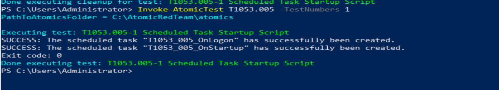 
Creates a scheduled task that runs a hidden script. (Test 1 — Scheduled Task Startup Script.)


2.2 T1218.005 — MSHTA (Defense Evasion)
```powershell
Invoke-AtomicTest T1218.005 -ShowDetailsBrief
Invoke-AtomicTest T1218.005 -TestNumbers 1
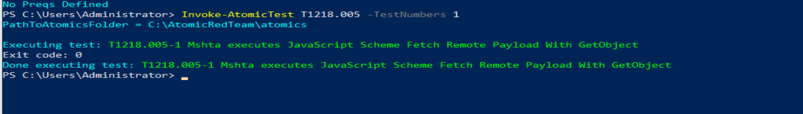
Uses mshta.exe to execute a remote .hta payload, bypassing application control. (Test 1 — Mshta executes JavaScript Scheme Fetch Remote Payload.)


2.3 T1003.001 — LSASS Dumping (Credential Access)
```powershell
Invoke-AtomicTest T1003.001 -ShowDetailsBrief
Invoke-AtomicTest T1003.001 -TestNumbers 1 -GetPrereqs
Invoke-AtomicTest T1003.001 -TestNumbers 1
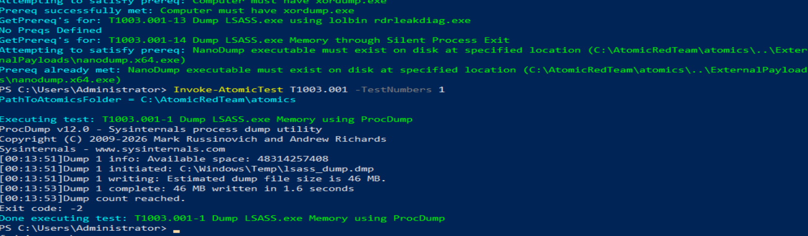
Uses procdump to dump LSASS memory and steal credentials. (Test 1 — Dump LSASS.exe Memory using ProcDump.)


2.4 T1059.001 — PowerShell Download (Execution)
```powershell
Invoke-AtomicTest T1059.001 -ShowDetailsBrief
Invoke-AtomicTest T1059.001 -TestNumbers 1
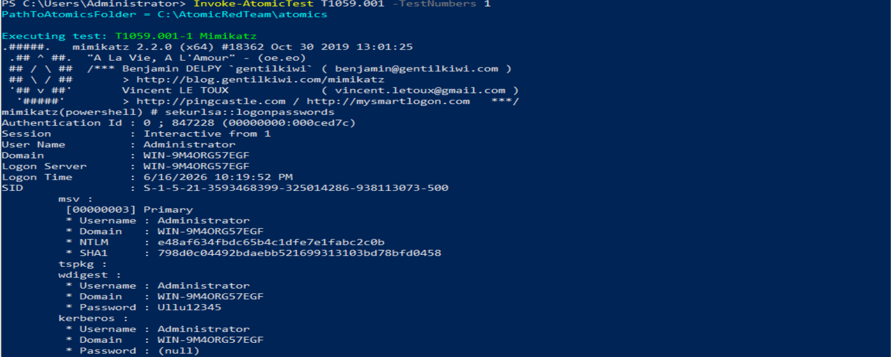
Downloads and executes a script from the web using a PowerShell download cradle.

2.5 T1112 — Modify Registry (Defense Evasion)
```powershell
Invoke-AtomicTest T1112 -ShowDetailsBrief
Invoke-AtomicTest T1112 -TestNumbers 2
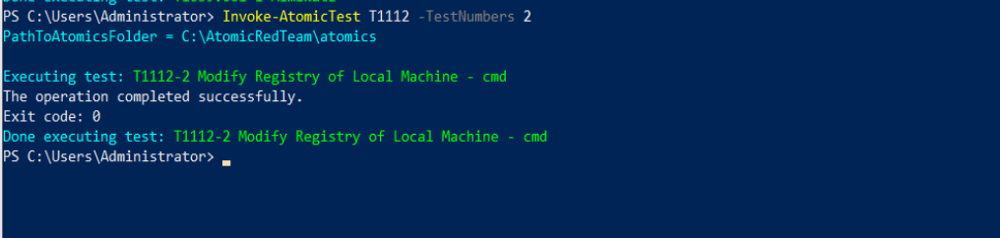
Alters or disables native Windows Defender real-time monitoring and security tracking policies via command-line registry modification utilities (Test 2). This prevents the host security subsystem from alerting on subsequent adversarial activity.


##PART 3: The Detection (Blue Team)

Logging into Splunk Web on Kali (http://192.168.189.129:8000), each of the five attacks is hunted using behaviour-based SPL — never by searching for the word “Atomic”.

###3.1 T1053.005 — Scheduled Task (Persistence)
Detect creation of a scheduled task via the schtasks.exe process and its /create command line. Event ID 7.
```
index=* host="WIN-9M4ORG57EGF" "schtasks.exe"
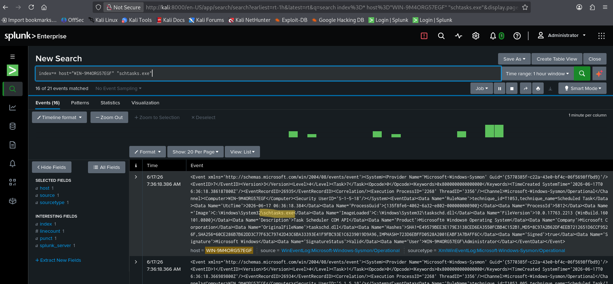
 
Most Useful Event ID: Looking at Event ID 7 gives defenders a major advantage during an investigation. Even if an advanced attacker attempts to hide or clear their Process Creation logs (Event ID 1), or uses a renamed version of the command-line utility to bypass basic rule alerts, they cannot stop the program from loading the required system DLLs (taskschd.dll) to talk to the Task Scheduler service. Tracking the loading of this specific module provides a highly reliable,

###3.2 T1218.005 — MSHTA (Defense Evasion)

Detect mshta.exe executing a remote .hta / inline script to bypass application control. Event id 13.
```
index=* host="WIN-9M4ORG57EGF" "mshta.exe"
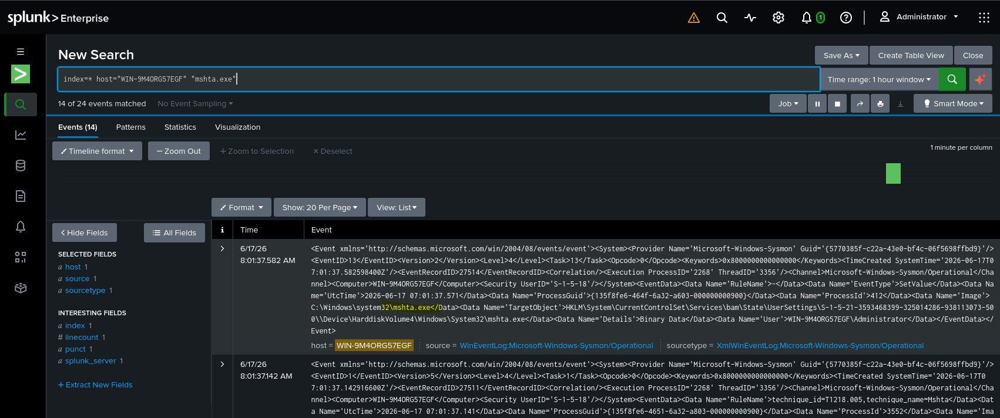
 
Most Useful Event ID: Sysmon Event ID 13 is explicitly used for Registry Value Set events (when a registry key value is created or modified). It doesn't actually log the execution of a file like mshta.exe or track network connections. Instead, the most useful Event ID for detecting an MSHTA inline or remote script attack is Sysmon Event ID 1 (Process Creation) or Sysmon Event ID 3 (Network Connection).

###3.3 T1003.001 — LSASS Memory Dumping (Credential Access)
Detect a process opening LSASS memory (e.g. procdump) to steal credentials. Event Id 10
```
index=* host="WIN-9M4ORG57EGF" "procdump*"
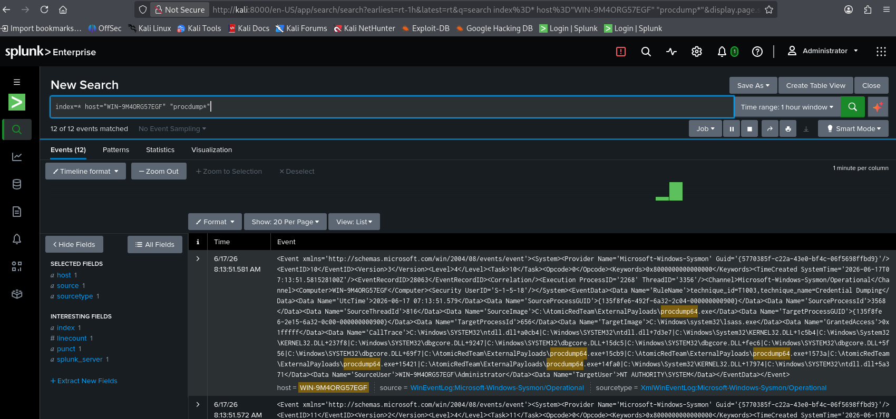 

Most useful Event ID: Sysmon Event ID 10 (Process Access). A non-system SourceImage opening lsass.exe with GrantedAccess such as 0x1010 or 0x1410 is the genuine credential-theft behaviour — far more reliable than matching the tool name.

###7.4 T1059.001 — PowerShell Download Cradle (Execution)
Detect PowerShell downloading and executing a remote script. Event ID 1.
```
index=* host="WIN-9M4ORG57EGF" “powershell”  "Download"
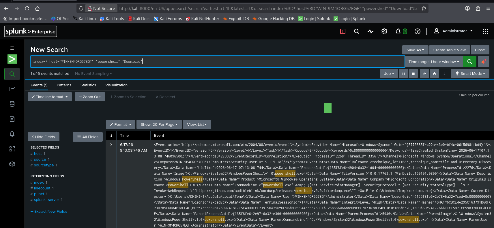 
 
Most useful Event ID: Sysmon Event ID 1 (Process Create) for the command line, complemented by PowerShell Event ID 4104 (Script Block Logging), which captures the de-obfuscated download cradle.

###3.5 T1112 — Modify Registry (Defense Evasion)
Detect suspicious registry value writes. Defender tamper keys, credential-storage keys, or Internet Explorer Trusted-Sites entries. Event ID: 13.
```
index=* host="WIN-9M4ORG57EGF" "reg.exe"
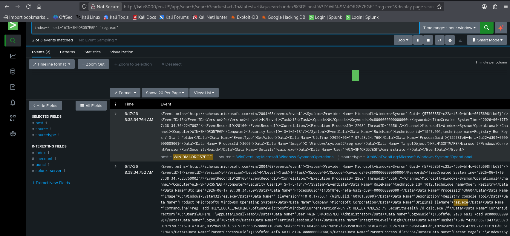 
 
Most useful Event ID: Sysmon Event ID 13 (Registry Value Set). It records the exact registry key and value written Defender, credential-storage or Trusted-Sites keys and the process that set it.

###Sysmon Event ID Summary & Conclusion
The table below records, for each of the five techniques, the Sysmon (or Windows) Event ID that proved most useful for detection and the reason it was decisive.
| Technique | Attack | Most Useful Event IDs | Why it was decisive |
| :--- | :--- | :--- | :--- |
| T1053.005 | Scheduled Task (Persistence) | Sysmon ID 7 | Looking at Event ID 7 gives defenders a major advantage during an investigation. Even if an advanced attacker attempts to hide or clear their Process Creation logs (Event ID 1), or uses a renamed version of the command-line utility to bypass basic rule alerts, they cannot stop the program from loading the required system DLLs (taskschd.dll) to talk to the Task Scheduler service. |
| T1218.005 | MSHTA (Defense Evasion) | Sysmon ID 13 | Sysmon Event ID 13 is explicitly used for Registry Value Set events (when a registry key value is created or modified). It doesn't actually log the execution of a file like mshta.exe or track network connections. Instead, the most useful Event ID for detecting an MSHTA inline or remote script attack is Sysmon Event ID 1 (Process Creation) or Sysmon Event ID 3 (Network Connection). |
| T1003.001 | LSASS Dumping (Credential Access) | Sysmon ID 10 | A non-system process opening lsass.exe with GrantedAccess 0x1010/0x1410 is the true credential-theft signal. |
| T1059.001 | PowerShell Download (Execution) | Sysmon ID 1 | powershell.exe command line / script-block text shows the download cradle (DownloadString, IEX, Net.WebClient). |
| T1112 | Registry Modification (Defense Evasion) | Sysmon ID 13 (Registry Set) | Registry value writes (Defender tamper keys, credential-storage keys, or IE Trusted-Sites entries) are captured at the moment of modification. |
